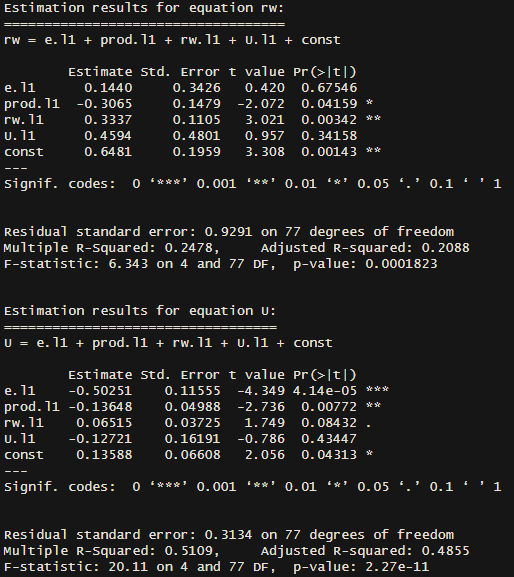
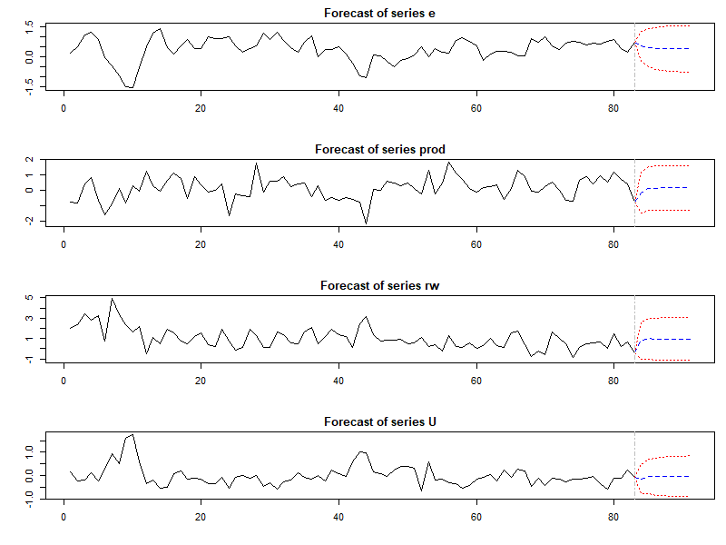

# Vector Autoregression (VAR) Analysis with Canada Dataset

## Overview
This repository provides a comprehensive guide to performing Vector Autoregression (VAR) analysis in R. It covers steps such as stationarity checks, lag selection, model estimation, diagnostics, impulse response function (IRF) analysis, and forecasting.

---

## Getting Started

### Prerequisites

- **R** (version 4.0 or higher)
- Required libraries: `vars`, `tseries`

### Installation

Install the necessary R packages:

```R
install.packages(c("vars", "tseries"))
```

---

## Contents

### Load Libraries and Data

#### Code:
```R
# Load necessary libraries
library(vars)
library(tseries)

# Load the Canada dataset
data("Canada")
head(Canada)
```

#### Interpretation:
The Canada dataset includes the following variables:

- **e**: Employment
- **prod**: Productivity
- **rw**: Real wages
- **U**: Unemployment

These variables represent key macroeconomic indicators, and the dataset will be used to model their interactions dynamically.

---

### Stationarity Check

#### Code:
```R
# Perform ADF test for stationarity
adf_test <- apply(Canada, 2, function(series) adf.test(series)$p.value)

# Check if differencing is required
needs_diff <- adf_test > 0.05
Canada_diff <- if (any(needs_diff)) diff(Canada) else Canada
```


#### Interpretation:
- **Augmented Dickey-Fuller (ADF) tests** indicate whether the variables are stationary.
- Variables with p-values > 0.05 are differenced to achieve stationarity.

---

### Lag Selection

#### Code:
```R
# Select optimal lag using AIC
lag_selection <- VARselect(Canada_diff, lag.max = 10, type = "const")
optimal_lag <- lag_selection$selection["AIC(n)"]
```


#### Interpretation:
- The **Akaike Information Criterion (AIC)** suggests the optimal number of lags for the VAR model.
- In this example, lag 1 is optimal.

---

### Estimate VAR Model

#### Code:
```R
# Fit VAR model
var_model <- VAR(Canada_diff, p = optimal_lag, type = "const")
summary(var_model)
```




#### Interpretation:
- The fitted VAR model captures the relationships between **e**, **prod**, **rw**, and **U**.
- Coefficients reveal the lagged impact of each variable on others.

---

### Stability Check

#### Code:
```R
# Stability test
stability <- stability(var_model)
roots <- roots(var_model)

# Plot stability
plot(stability)
```
[1] 0.74310551 0.40100508 0.10945167 0.06195264
The model is stationary (all roots are less than 1).

| Root Value |
|------------|
| 0.7431     |
| 0.4010     |
| 0.1095     |
| 0.0620     |

Since all roots are less than 1, the model is confirmed to be stationary. This indicates that the VAR model satisfies the stability condition, and its dynamics are well-behaved over time.

#### Interpretation:
- The VAR model is stable if all roots of the characteristic polynomial are less than 1.
- Stability ensures meaningful forecasts and impulse response analyses.

---

### Forecast Error Variance Decomposition (FEVD)

#### Code:
```R
# FEVD analysis
fevd_result <- fevd(var_model, n.ahead = 8)
plot(fevd_result, legend.pos = "topright")
```


#### Interpretation:
- **FEVD** explains the proportion of forecast error variance for each variable caused by shocks to itself and other variables.
- Example: Productivity (**prod**) is primarily influenced by its own shocks.

---

### Impulse Response Function (IRF)

#### Code:
```R
# Analyze the effect of a shock to `prod`
irf_result <- irf(var_model, impulse = "prod", response = c("e", "rw", "U"), n.ahead = 20, boot = TRUE)
plot(irf_result)
```


#### Interpretation:
- A shock to **prod** has:
  - A transient effect on **e** (employment), stabilizing over time.
  - A notable impact on **rw** (real wages), which gradually diminishes.
  - A smaller but noticeable influence on **U** (unemployment), returning to equilibrium.

---

### Forecasting

#### Code:
```R
# Generate forecasts
forecast <- predict(var_model, n.ahead = 8)

# Plot forecasts
plot(forecast)
```


#### Interpretation:
- Forecasts provide insights into the future behavior of variables (**e**, **prod**, **rw**, **U**).
- Confidence intervals widen over time, reflecting increasing uncertainty.

---

## Conclusion
This guide demonstrates how to conduct a comprehensive VAR analysis using R. By following these steps, you can model and interpret the dynamic interrelationships among key economic indicators. For additional information, consult the official documentation of the `vars` package.
